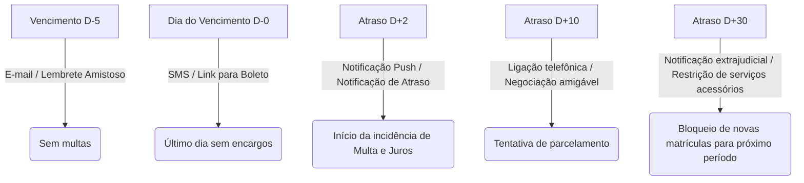

# Resumos Estruturados: Gestão de Inadimplência Escolar

Compilado de resumos e guias visuais criados para fixar a lógica de negócios e as regras financeiras aplicadas à gestão escolar.

## 📈 1. A Lógica de Cálculo de Atrasos

Para calcular taxas de atraso em mensalidades escolares de forma justa e dentro dos limites legais, utilizamos a seguinte modelagem lógica:

### Variáveis Necessárias
- $V_{orig}$ = Valor original da parcela
- $D_{venc}$ = Data de vencimento
- $D_{pag}$ = Data de pagamento efetivo
- $N$ = Dias de atraso ($D_{pag} - D_{venc}$)
- $M$ = Percentual de multa (máximo legal de 2%)
- $J_{mes}$ = Taxa de juros mensal (máximo usual de 1%)

### Fórmulas de Cálculo
1. **Multa (Fixa pós-vencimento):**
   $$Multa = V_{orig} \times M$$
2. **Juros de Mora (Pro Rata Die - proporcional aos dias):**
   $$Juros\_Diarios = \frac{J_{mes}}{30}$$
   $$Juros = V_{orig} \times (Juros\_Diarios \times N)$$
3. **Valor Total Devido:**
   $$V_{total} = V_{orig} + Multa + Juros$$

---

## 🔔 2. Régua de Cobrança e Alertas

Uma régua de cobrança eficaz define ações específicas baseadas nos dias de atraso ($N$). Abaixo está um exemplo de modelagem de canais de comunicação e alertas:

