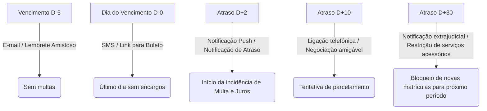

# Resumos Estruturados: Gestão de Inadimplência Escolar

Compilado de resumos e guias visuais criados para fixar a lógica de negócios e as regras financeiras aplicadas à gestão escolar.

## 📈 1. A Lógica de Cálculo de Atrasos

Para calcular taxas de atraso em mensalidades escolares de forma justa e dentro dos limites legais, utilizamos a seguinte modelagem lógica:

### Variáveis Necessárias
- $V_{orig}$ = Valor original da parcela
- $D_{venc}$ = Data de vencimento
- $D_{pag}$ = Data de pagamento efetivo
- $N$ = Dias de atraso ($D_{pag} - D_{venc}$)
- $M$ = Percentual de multa (máximo legal de 2%)
- $J_{mes}$ = Taxa de juros mensal (máximo usual de 1%)

### Fórmulas de Cálculo
1. **Multa (Fixa pós-vencimento):**
   $$Multa = V_{orig} \times M$$
2. **Juros de Mora (Pro Rata Die - proporcional aos dias):**
   $$Juros\_Diarios = \frac{J_{mes}}{30}$$
   $$Juros = V_{orig} \times (Juros\_Diarios \times N)$$
3. **Valor Total Devido:**
   $$V_{total} = V_{orig} + Multa + Juros$$

---

## 🔔 2. Régua de Cobrança e Alertas

Uma régua de cobrança eficaz define ações específicas baseadas nos dias de atraso ($N$). Abaixo está um exemplo de modelagem de canais de comunicação e alertas:



---

## 💻 3. Traduzindo em Código (Exercício de Lógica)

Para demonstrar a maturidade técnica exigida na transição de carreira, traduzimos as regras de negócio em códigos utilizáveis de banco de dados (SQL) e de programação (JavaScript).

### Exemplo de Query SQL (Cálculo em Tempo Real)
Uma query comum em ERPs escolares para gerar relatórios financeiros e calcular os valores com juros acumulados até o dia atual:

```sql
SELECT 
    parcela_id,
    valor_original,
    data_vencimento,
    CURRENT_DATE AS data_consulta,
    
    -- Lógica: Dias de atraso (apenas se data atual > vencimento e não estiver paga)
    CASE 
        WHEN CURRENT_DATE > data_vencimento AND status = 'Em Aberto' 
        THEN CURRENT_DATE - data_vencimento
        ELSE 0
    END AS dias_atraso,
    
    -- Lógica da Multa: 2% fixa
    CASE 
        WHEN CURRENT_DATE > data_vencimento AND status = 'Em Aberto' 
        THEN valor_original * 0.02
        ELSE 0
    END AS valor_multa,
    
    -- Lógica dos Juros: 1% ao mês (0,0333% ao dia) pro rata die
    CASE 
        WHEN CURRENT_DATE > data_vencimento AND status = 'Em Aberto' 
        THEN valor_original * (0.01 / 30) * (CURRENT_DATE - data_vencimento)
        ELSE 0
    END AS valor_juros,
    
    -- Valor total atualizado para pagamento
    CASE 
        WHEN CURRENT_DATE > data_vencimento AND status = 'Em Aberto' 
        THEN valor_original + (valor_original * 0.02) + (valor_original * (0.01 / 30) * (CURRENT_DATE - data_vencimento))
        ELSE valor_original
    END AS valor_total_atualizado

FROM mensalidades;
```

### Função em JavaScript (Lógica de Backend/API)
Esta função simula como a lógica de negócios de uma API de cobrança calcularia o valor atualizado na baixa de um boleto vencido:

```javascript
function calcularParcelaAtualizada(valorOriginal, dataVencimentoStr, dataPagamentoStr) {
    const vencimento = new Date(dataVencimentoStr);
    const pagamento = new Date(dataPagamentoStr);
    
    // Calcula a diferença em milissegundos e converte para dias inteiros
    const diferencaTempo = pagamento.getTime() - vencimento.getTime();
    const diasAtraso = Math.ceil(diferencaTempo / (1000 * 60 * 60 * 24));
    
    // Se não houver atraso, cobra apenas o valor original
    if (diasAtraso <= 0) {
        return {
            valorOriginal,
            diasAtraso: 0,
            multa: 0.00,
            juros: 0.00,
            valorTotal: valorOriginal
        };
    }
    
    // Multa fixa de 2% (limite do CDC)
    const multa = valorOriginal * 0.02;
    
    // Juros pro rata die baseados em 1% ao mês (0.0333% ao dia)
    const taxaDiaria = 0.01 / 30;
    const juros = valorOriginal * taxaDiaria * diasAtraso;
    
    const valorTotal = valorOriginal + multa + juros;
    
    return {
        valorOriginal: valorOriginal.toFixed(2),
        diasAtraso,
        multa: multa.toFixed(2),
        juros: juros.toFixed(2),
        valorTotal: valorTotal.toFixed(2)
    };
}

// Exemplo de teste: Mensalidade de R$ 1.200,00 com 15 dias de atraso
console.log(calcularParcelaAtualizada(1200.00, "2026-05-10", "2026-05-25"));
/*
Saída esperada:
{
  valorOriginal: '1200.00',
  diasAtraso: 15,
  multa: '24.00',
  juros: '6.00',
  valorTotal: '1230.00'
}
*/
```
